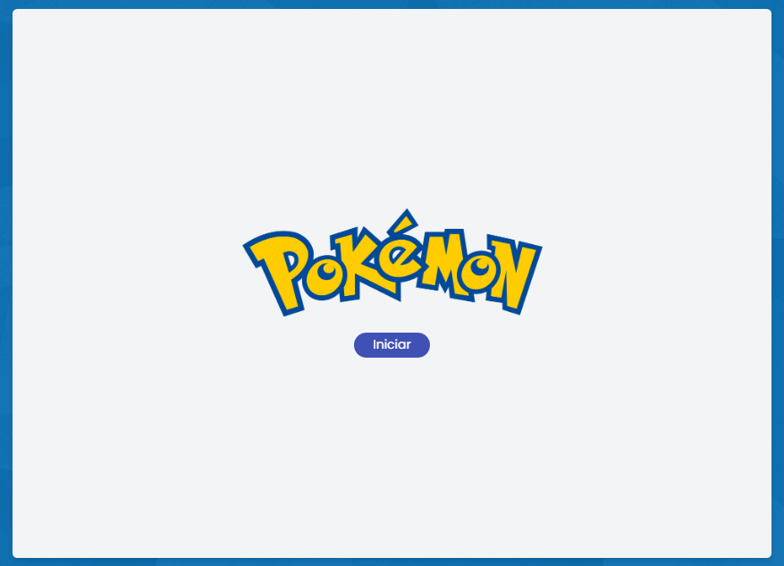
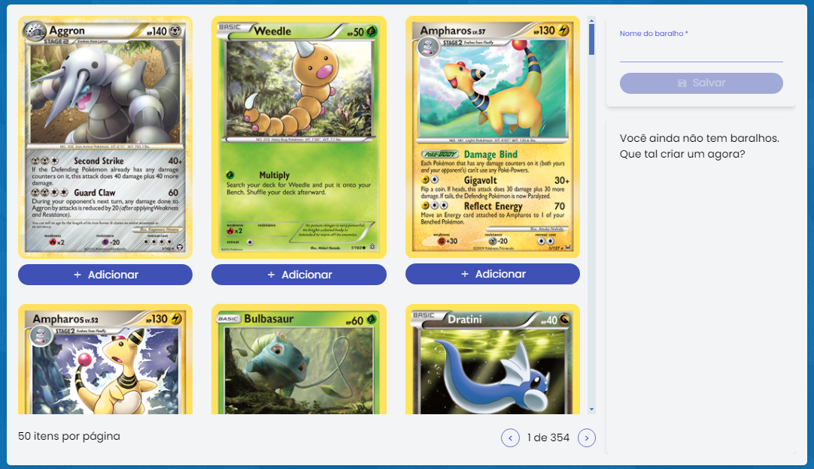
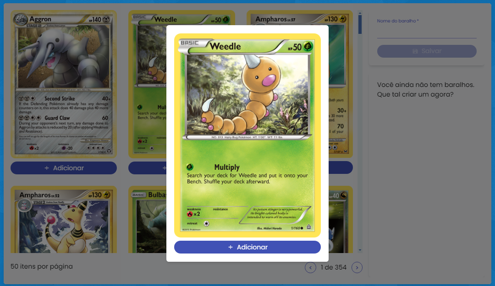
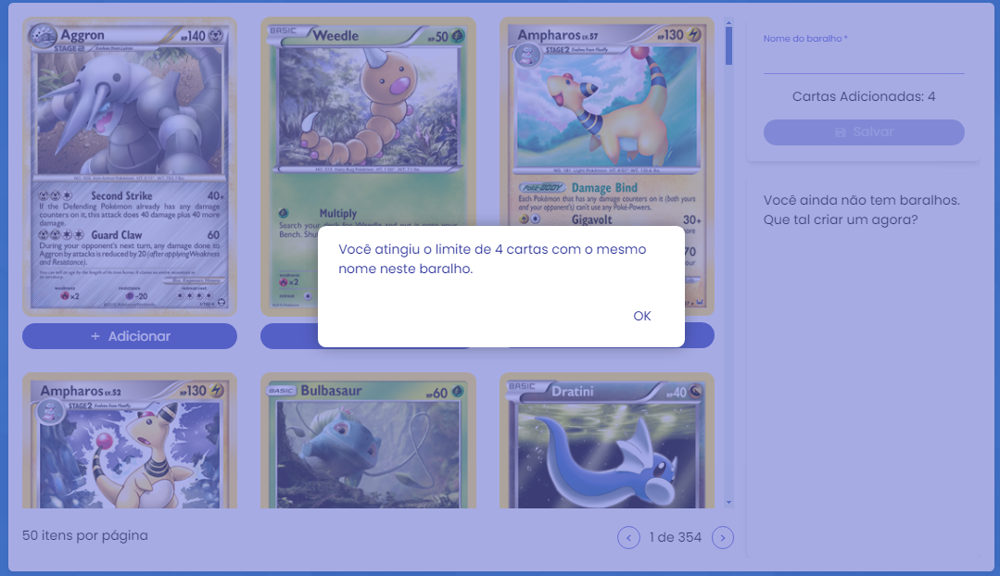
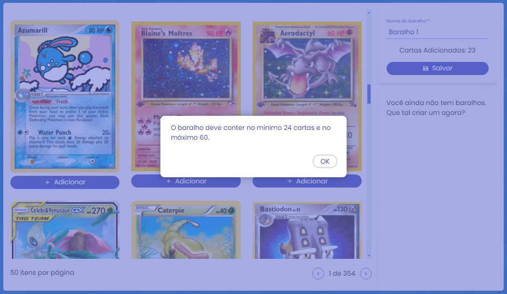
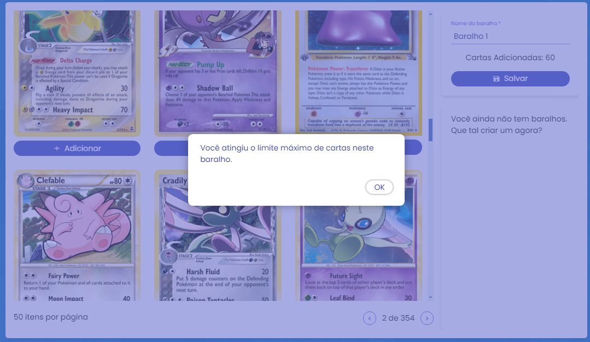
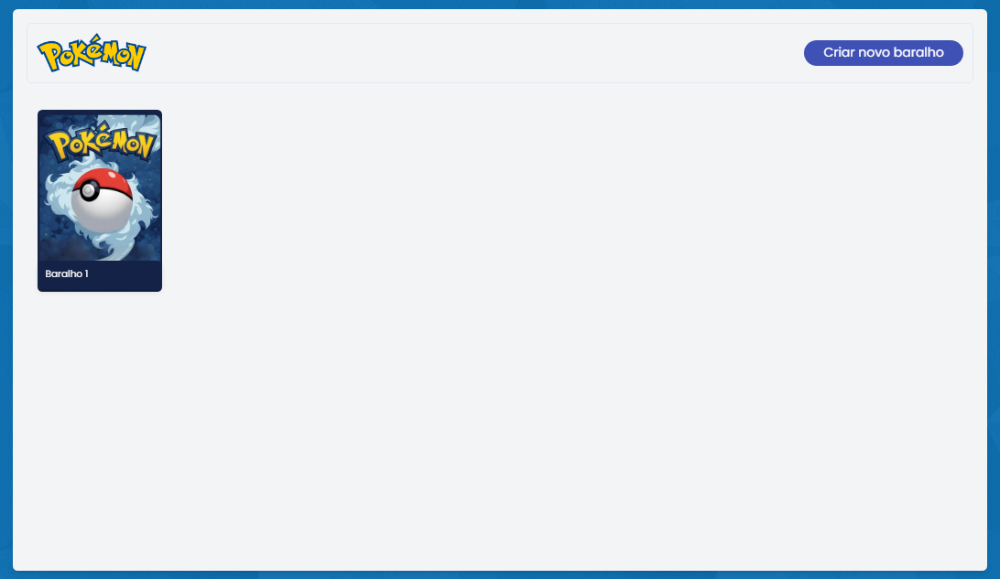
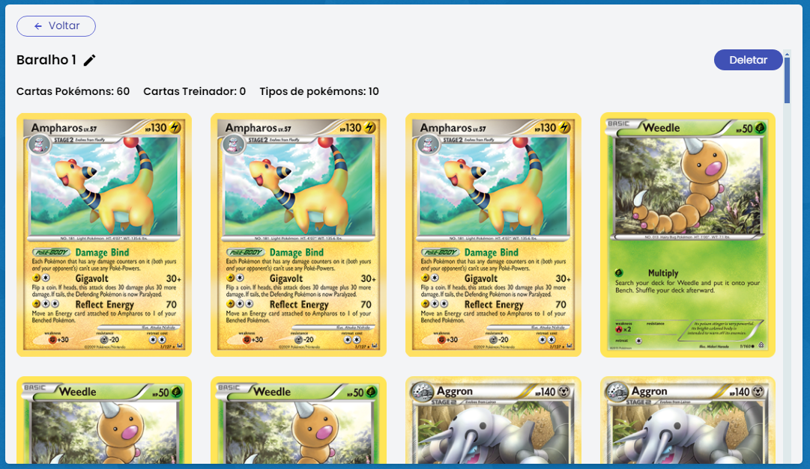

# Pokémon TCG 

## Tecnologias utilizadas: 

Framework Angular 17, Angular Material(UI), Tailwind e a biblioteca UI Infragistics.

## Compilar
1 - ``npm install`` 

2 -  ``npm install -g json-server`` - para simular a API

3 - ``npm start`` ou ``ng serve`` 

4 -  Entre no diretório ``/api`` pelo terminal e rode o comando ``json-server --watch db.json``

## Criando Baralho

Página inicial ``localhost:4500/``

Clique em iniciar

Aqui temos 50 cartas por página, para facilitar o carregamento. 
*As cartas podem ser adicionadas ao baralho clicando no botão adicionar.
*O botão de salvar é habilitado quando tiver no mínimo 3 caracter no input.

Ao clicar em cima da carta, abre um pou-up para detalhes.

O limite de 4 cartas com o mesmo nome é informado assim que atingir a quantidade.

Não é possível salvar o baralho com menos de 24 cartas

Quando o limite de 60 cartas por baralho for atingido, não será possível a adição mais cartas.

Quando salvar, você será redirecionado para a home de baralhos.

Clique no baralho para detalhes
Aqui podemos deletar o baralho e alterar o nome clicando no incone de edição.
*Podemos ver a carta em pop-up clicando nela.

Clique no baralho para detalhes
Aqui podemos deletar o baralho e alterar o nome clicando no ícone de edição.

Quando tiver 1 ou mais baralhos criados, ele aparece como atalhos na home de criação.
